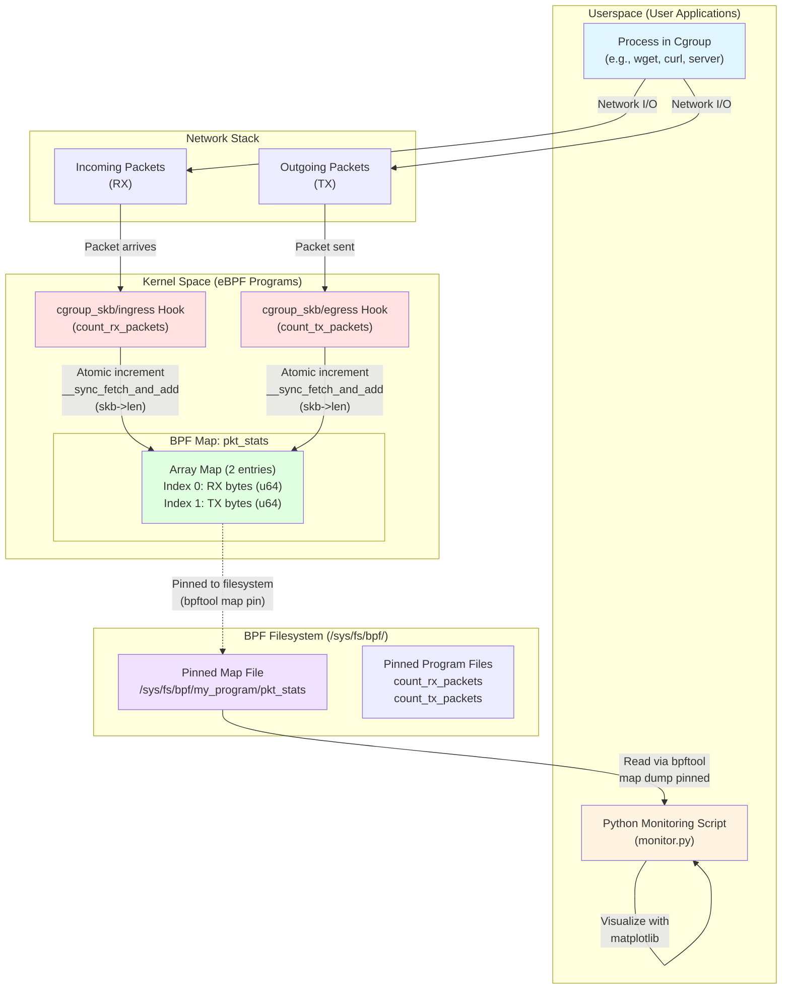
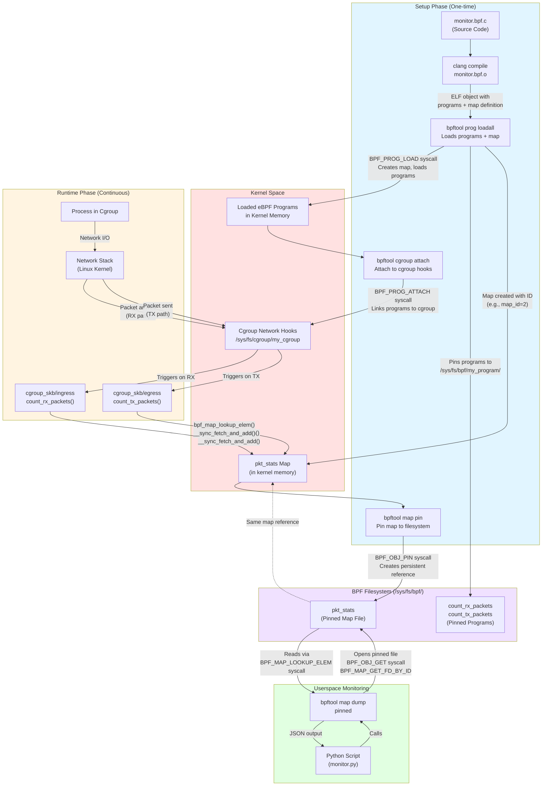

# eBPF Network Monitoring with Cgroups

## Overview

This guide demonstrates how to build a network traffic monitoring system using eBPF (extended Berkeley Packet Filter) programs attached to Linux cgroups. The system tracks incoming (RX) and outgoing (TX) network traffic for processes within a specific cgroup, providing real-time statistics that can be visualized with a Python monitoring script.

### How It Works

- **eBPF Programs**: Two programs hook into the network stack at the cgroup level - one for ingress (incoming) traffic and one for egress (outgoing) traffic
- **BPF Maps**: Statistics are stored in a shared BPF map that can be accessed from userspace
- **Cgroups**: Processes are assigned to a cgroup, and all their network traffic is automatically monitored
- **Visualization**: A Python script reads the BPF map and displays real-time network usage graphs

### Architecture



#### Complete System Lifecycle (Setup + Runtime)

The following chart shows the complete flow from compilation to runtime, including how programs are loaded, how maps are extracted and pinned, and where packet processing functions are located:



**Key Points from the Complete Lifecycle:**

1. **Program Loading**: `bpftool prog loadall` compiles the ELF object, creates the map in kernel memory, and loads the eBPF programs via `BPF_PROG_LOAD` syscall
2. **Map Extraction**: The map is automatically created during program loading with a unique map ID. We then use `bpftool map pin id <map_id>` to create a persistent filesystem reference
3. **Program Attachment**: Programs are attached to cgroup hooks using `BPF_PROG_ATTACH` syscall, linking them to the network stack at `/sys/fs/cgroup/my_cgroup`
4. **Map Accessibility**: The pinned map file acts as a bridge - it's the same kernel memory object, but accessible from userspace via file descriptor operations (`BPF_OBJ_GET`, `BPF_MAP_LOOKUP_ELEM`)
5. **Packet Processing Location**: The eBPF functions (`count_rx_packets`, `count_tx_packets`) execute in kernel space, hooked into the network stack at the cgroup level, triggered automatically for all packets to/from processes in the cgroup

#### How `pkt_stats` Map is Accessed

The `pkt_stats` BPF map is a **shared memory structure** that bridges kernel and userspace:

1. **Kernel Access (eBPF Programs)**:
   - Both `count_rx_packets` and `count_tx_packets` programs access the map directly using `bpf_map_lookup_elem()` and `bpf_map_update_elem()`
   - Updates are atomic using `__sync_fetch_and_add()` for thread-safe concurrent access
   - The map is stored in kernel memory and accessible only to eBPF programs during packet processing

2. **Userspace Access (Python Script)**:
   - The map is **pinned to the filesystem** at `/sys/fs/bpf/my_program/pkt_stats`
   - Pinning creates a persistent reference that survives program loading/unloading
   - Userspace reads the map using `bpftool map dump pinned <path>` which:
     - Opens the pinned file descriptor
     - Reads the map contents via the BPF syscall interface
     - Returns JSON-formatted data with key-value pairs

3. **Data Structure**:
   - **Type**: `BPF_MAP_TYPE_ARRAY` (fixed-size array)
   - **Size**: 2 entries (indices 0 and 1)
   - **Key**: `u32` (the array index: 0 for RX, 1 for TX)
   - **Value**: `u64` (64-bit counter storing total bytes)

4. **Access Flow**:
   ```
   Kernel: Packet → eBPF Hook → Atomic Update → pkt_stats[key] += packet_size
   Userspace: bpftool → Open pinned file → BPF syscall → Read pkt_stats[key] → JSON output
   ```

#### How the System Works

1. **Cgroup Assignment**: Processes are moved into a cgroup by writing their PID to `/sys/fs/cgroup/my_cgroup/cgroup.procs`

2. **Program Attachment**: eBPF programs are attached to the cgroup's network hooks:
   - **Ingress hook** triggers for all incoming packets to processes in the cgroup
   - **Egress hook** triggers for all outgoing packets from processes in the cgroup

3. **Packet Processing**: When network traffic occurs:
   - Each packet triggers the appropriate hook (ingress or egress)
   - The eBPF program extracts the packet size (`skb->len`)
   - The program atomically increments the corresponding counter in `pkt_stats`
   - The packet continues normally through the network stack (return value `1`)

4. **Statistics Collection**: The Python script periodically:
   - Reads the pinned map using `bpftool`
   - Calculates throughput (bytes per second) by comparing consecutive reads
   - Displays real-time graphs showing RX and TX traffic rates

---

## Prerequisites

### System Requirements

- Linux kernel with BTF (BPF Type Format) support (typically kernel 5.2+)
- Root/sudo access for loading eBPF programs and managing cgroups
- Cgroups v2 filesystem mounted at `/sys/fs/cgroup`

### Check Kernel BTF Support

Verify that your kernel has BTF enabled:

```bash
ls /sys/kernel/btf/vmlinux
```

If this file exists, your kernel supports BTF and you can generate `vmlinux.h`.

### Install Required Packages

Install the necessary tools and libraries:

```bash
# Install build tools, BPF development libraries, and monitoring utilities
sudo apt install clang llvm libbpf-dev jq python3-matplotlib linux-tools-$(uname -r) linux-tools-common
```

Verify the installation:

```bash
bpftool version
```

You should see the bpftool version information.

---

## eBPF Program Source Code

Create a file named `monitor.bpf.c` with the following code:

```c:monitor.bpf.c
#include "vmlinux.h"
#include <bpf/bpf_helpers.h>

// Define a BPF map to store network statistics
// Array type with 2 entries: index 0 = RX (receive), index 1 = TX (transmit)
struct {
    __uint(type, BPF_MAP_TYPE_ARRAY);
    __type(key, u32);
    __type(value, u64);
    __uint(max_entries, 2);
} pkt_stats SEC(".maps");

// Egress hook: called for outgoing packets (TX)
// This program attaches to the cgroup's egress path
SEC("cgroup_skb/egress")
int count_tx_packets(struct __sk_buff *skb) {
    u32 key = 1; // Index 1 represents TX (transmit) traffic
    u64 *val, init_val = 0;

    // Look up the current value in the map
    val = bpf_map_lookup_elem(&pkt_stats, &key);
    if (!val) {
        // If the entry doesn't exist, initialize it to 0
        bpf_map_update_elem(&pkt_stats, &key, &init_val, BPF_ANY);
        val = bpf_map_lookup_elem(&pkt_stats, &key);
    }

    // Atomically add the packet length to the counter
    // __sync_fetch_and_add is thread-safe for concurrent access
    if (val) {
        __sync_fetch_and_add(val, skb->len);
    }

    return 1; // Return 1 to allow the packet to pass through
}

// Ingress hook: called for incoming packets (RX)
// This program attaches to the cgroup's ingress path
SEC("cgroup_skb/ingress")
int count_rx_packets(struct __sk_buff *skb) {
    u32 key = 0; // Index 0 represents RX (receive) traffic
    u64 *val, init_val = 0;

    // Look up the current value in the map
    val = bpf_map_lookup_elem(&pkt_stats, &key);
    if (!val) {
        // If the entry doesn't exist, initialize it to 0
        bpf_map_update_elem(&pkt_stats, &key, &init_val, BPF_ANY);
        val = bpf_map_lookup_elem(&pkt_stats, &key);
    }

    // Atomically add the packet length to the counter
    // __sync_fetch_and_add is thread-safe for concurrent access
    if (val) {
        __sync_fetch_and_add(val, skb->len);
    }

    return 1; // Return 1 to allow the packet to pass through
}

// Required license declaration for eBPF programs
char LICENSE[] SEC("license") = "GPL";
```

### Key Components Explained

- **BPF Map (`pkt_stats`)**: A shared memory structure accessible from both kernel (eBPF programs) and userspace. It's an array with 2 entries storing 64-bit counters.
- **Cgroup Hooks**: 
  - `cgroup_skb/ingress`: Triggered for incoming packets to processes in the cgroup
  - `cgroup_skb/egress`: Triggered for outgoing packets from processes in the cgroup
- **Atomic Operations**: `__sync_fetch_and_add` ensures thread-safe updates when multiple packets are processed concurrently
- **Return Value**: Returning `1` allows the packet to proceed normally through the network stack

---

## Compilation

### Generate vmlinux.h

The `vmlinux.h` header file contains kernel type definitions needed for compilation. Generate it from your kernel's BTF data:

```bash
# Generate vmlinux.h from kernel BTF (requires BTF-enabled kernel)
bpftool btf dump file /sys/kernel/btf/vmlinux format c > vmlinux.h
```

**Note**: If your kernel doesn't have BTF support, you'll need to manually generate or obtain `vmlinux.h` using other methods.

### Compile the eBPF Program

Compile the C source code into an eBPF object file:

```bash
# Compile with optimizations and BPF target
# Adjust -D__TARGET_ARCH_x86 to match your architecture (x86, arm64, etc.)
clang -g -O2 -target bpf -D__TARGET_ARCH_x86 -c monitor.bpf.c -o monitor.bpf.o
```

**Architecture Note**: Replace `x86` with your target architecture:
- `x86` for x86_64/amd64
- `arm64` for ARM 64-bit
- `riscv` for RISC-V

Verify the object file was created:

```bash
file monitor.bpf.o
# Should show: monitor.bpf.o: ELF 64-bit LSB relocatable, eBPF, version 1
```

---

## Setup and Installation

### Step 1: Create Cgroup Directory

Create a cgroup directory where we'll attach our eBPF programs:

```bash
# Create the cgroup directory
sudo mkdir -p /sys/fs/cgroup/my_cgroup
```

**Note**: Ensure you're using cgroups v2. If `/sys/fs/cgroup` is not mounted, you may need to mount it:
```bash
sudo mount -t cgroup2 none /sys/fs/cgroup
```

### Step 2: Load eBPF Programs

Load the compiled eBPF programs into the kernel:

```bash
# Load all programs from the object file and pin them to the filesystem
sudo bpftool prog loadall monitor.bpf.o /sys/fs/bpf/my_program
```

This command:
- Loads all eBPF programs from `monitor.bpf.o`
- Pins them to `/sys/fs/bpf/my_program/` for persistent access
- Creates files for each program: `count_rx_packets` and `count_tx_packets`

### Step 3: Attach Programs to Cgroup Hooks

Attach the loaded programs to the cgroup's network hooks:

```bash
# Attach ingress (RX) program
sudo bpftool cgroup attach /sys/fs/cgroup/my_cgroup ingress pinned /sys/fs/bpf/my_program/count_rx_packets

# Attach egress (TX) program
sudo bpftool cgroup attach /sys/fs/cgroup/my_cgroup egress pinned /sys/fs/bpf/my_program/count_tx_packets
```

### Step 4: Pin the BPF Map

The BPF map needs to be pinned to the filesystem so it can be accessed from userspace:

```bash
# First, find the map ID (usually 2 if this is your first map)
sudo bpftool map show

# Pin the map (replace '2' with the actual map ID from the previous command)
sudo bpftool map pin id 2 /sys/fs/bpf/my_program/pkt_stats
```

**Note**: The map ID may vary. Look for the map named `pkt_stats` in the output of `bpftool map show`.

### Step 5: Verify Installation

Verify that everything is set up correctly:

**Check loaded programs:**
```bash
sudo bpftool prog show
```

Expected output should show both programs:
```
66: cgroup_skb  name count_tx_packets  tag 60dc5a8ca52f8e5d  gpl
	loaded_at 2025-12-26T10:08:57+0000  uid 0
	xlated 328B  jited 189B  memlock 4096B  map_ids 2
	btf_id 82
67: cgroup_skb  name count_rx_packets  tag efc54de37e4361e6  gpl
	loaded_at 2025-12-26T10:08:57+0000  uid 0
	xlated 152B  jited 96B  memlock 4096B  map_ids 2
	btf_id 82
```

**Check cgroup attachments:**
```bash
sudo bpftool cgroup show /sys/fs/cgroup/my_cgroup/
```

Expected output:
```
ID       AttachType      AttachFlags     Name           
67       cgroup_inet_ingress             count_rx_packets                
66       cgroup_inet_egress              count_tx_packets      
```

**Verify pinned files:**
```bash
sudo ls -R /sys/fs/bpf/my_program
```

Expected output:
```
/sys/fs/bpf/my_program:
count_rx_packets  count_tx_packets  pkt_stats  
```

**Check map contents (should show zeros initially):**
```bash
sudo bpftool map dump pinned /sys/fs/bpf/my_program/pkt_stats
```

Expected output (initially):
```json
[{
    "key": 0,
    "value": 0
},{
    "key": 1,
    "value": 0
}]
```

---

## Usage

### Step 1: Start Monitoring (Terminal 1)

You can monitor the statistics in real-time using `watch`:

```bash
# Watch the map contents update every second
sudo watch -n 1 "bpftool map dump pinned /sys/fs/bpf/my_program/pkt_stats"
```

Alternatively, use the Python monitoring script (see [Python Monitoring Script](#python-monitoring-script) section below).

### Step 2: Add Process to Cgroup (Terminal 2)

In a new terminal, add your current shell process to the cgroup:

```bash
# Write the current shell's PID into the cgroup.procs file
# This moves the current process (and its children) into the cgroup
echo $$ | sudo tee /sys/fs/cgroup/my_cgroup/cgroup.procs

# Verify you are inside the cgroup (should show "my_cgroup")
cat /proc/self/cgroup
```

The output should include a line showing your cgroup path.

### Step 3: Generate Network Traffic

Now any network activity from processes in this terminal will be monitored. Try:

```bash
# Download a test file (will show RX traffic spike)
wget http://speedtest.tele2.net/10MB.zip

# Or use ping for small TX/RX traffic
ping -c 10 google.com

# Or start a web server and make requests to it
python3 -m http.server 8000
# Then in another terminal: curl http://localhost:8000
```

Watch the statistics update in Terminal 1 or the Python graph!

### Step 4: View Statistics

You can query the statistics at any time:

```bash
# Dump the map contents
sudo bpftool map dump pinned /sys/fs/bpf/my_program/pkt_stats

# Or get JSON output
sudo bpftool map dump pinned /sys/fs/bpf/my_program/pkt_stats -j
```

The output shows:
- `key: 0` = Total RX (receive) bytes
- `key: 1` = Total TX (transmit) bytes

---

## Python Monitoring Script

Create a file named `monitor.py` for real-time visualization:

```python:monitor.py
#!/usr/bin/env python3
"""
eBPF Network Traffic Monitor
Reads statistics from a pinned BPF map and displays real-time network usage graphs.
"""

import matplotlib.pyplot as plt
import matplotlib.animation as animation
import subprocess
import json
import time

# Configuration
MAP_PATH = "/sys/fs/bpf/my_program/pkt_stats"  # Path to pinned BPF map
RX_INDEX = 0  # Map index for receive (RX) traffic
TX_INDEX = 1  # Map index for transmit (TX) traffic

# Data storage for the graph
x_data = []      # Time points
y_rx = []        # RX bytes per second
y_tx = []        # TX bytes per second
start_time = time.time()

def get_network_usage():
    """
    Read network statistics from the pinned BPF map.
    Returns: (rx_total, tx_total) tuple of total bytes
    """
    try:
        # Request JSON output from bpftool
        cmd = ["sudo", "bpftool", "map", "dump", "pinned", MAP_PATH, "-j"]
        output = subprocess.check_output(cmd, stderr=subprocess.DEVNULL)
        data = json.loads(output)
        
        rx_total, tx_total = 0, 0
        
        # Parse the JSON output
        for entry in data:
            # Extract key and value from the entry
            # The structure may vary, so we handle both formats
            if isinstance(entry, dict):
                formatted = entry.get('formatted', {})
                key = formatted.get('key', 0)
                val = formatted.get('value', 0)
            else:
                continue
            
            if key == RX_INDEX:
                rx_total = val
            elif key == TX_INDEX:
                tx_total = val
                
        return rx_total, tx_total
    except Exception as e:
        print(f"Error reading map: {e}")
        return 0, 0

# Initialize the plot
fig, ax = plt.subplots()
line_rx, = ax.plot([], [], label="RX Bytes/sec", color="blue", linewidth=2)
line_tx, = ax.plot([], [], label="TX Bytes/sec", color="orange", linewidth=2)
ax.legend(loc='upper left')
ax.set_title("Live Network Usage (Cgroup)", fontsize=14, fontweight='bold')
ax.set_ylabel("Bytes per Second", fontsize=12)
ax.set_xlabel("Time (seconds)", fontsize=12)
ax.grid(True, alpha=0.3)

# Store previous values to calculate throughput (bytes per second)
last_rx = 0
last_tx = 0

def update(frame):
    """
    Animation update function called every second.
    Calculates bytes per second and updates the graph.
    """
    global last_rx, last_tx
    
    current_time = time.time() - start_time
    total_rx, total_tx = get_network_usage()
    
    # Calculate delta (bytes since last read) = bytes per second
    delta_rx = total_rx - last_rx
    delta_tx = total_tx - last_tx
    
    # Update previous values
    last_rx = total_rx
    last_tx = total_tx
    
    # Append new data points
    x_data.append(current_time)
    y_rx.append(delta_rx)
    y_tx.append(delta_tx)
    
    # Keep graph window moving (show last 60 seconds)
    if len(x_data) > 60:
        x_data.pop(0)
        y_rx.pop(0)
        y_tx.pop(0)
    
    # Update plot data
    line_rx.set_data(x_data, y_rx)
    line_tx.set_data(x_data, y_tx)
    
    # Auto-scale axes
    ax.relim()
    ax.autoscale_view()
    
    return line_rx, line_tx

# Start the animation (updates every 1000ms = 1 second)
ani = animation.FuncAnimation(fig, update, interval=1000, blit=True)
plt.show()
```

### Running the Monitor

```bash
# Make the script executable (optional)
chmod +x monitor.py

# Run the monitoring script
python3 monitor.py
```

The script will:
- Read statistics from the BPF map every second
- Calculate bytes per second (throughput)
- Display a live graph showing RX and TX traffic
- Keep a rolling window of the last 60 seconds

**Note**: The script requires `sudo` privileges to read the BPF map. You may need to run it with `sudo` or configure appropriate permissions.

---

## Troubleshooting

### Programs Not Loading

**Issue**: `bpftool prog loadall` fails

**Solutions**:
- Verify the object file was compiled correctly: `file monitor.bpf.o`
- Check kernel logs: `sudo dmesg | tail -20`
- Ensure you have a BTF-enabled kernel: `ls /sys/kernel/btf/vmlinux`
- Verify architecture flag matches your system

### Cgroup Not Found

**Issue**: Cannot create or access `/sys/fs/cgroup/my_cgroup`

**Solutions**:
- Check if cgroups v2 is mounted: `mount | grep cgroup2`
- Mount cgroups v2 if needed: `sudo mount -t cgroup2 none /sys/fs/cgroup`
- Verify you have write permissions (may need sudo)

### Map Not Accessible

**Issue**: Cannot read from the pinned map

**Solutions**:
- Verify the map is pinned: `ls -l /sys/fs/bpf/my_program/pkt_stats`
- Check map ID: `sudo bpftool map show | grep pkt_stats`
- Ensure you're using the correct path in your script
- Try reading manually: `sudo bpftool map dump pinned /sys/fs/bpf/my_program/pkt_stats`

### No Statistics Updating

**Issue**: Map shows zeros or values don't change

**Solutions**:
- Verify processes are in the cgroup: `cat /proc/self/cgroup`
- Check cgroup attachments: `sudo bpftool cgroup show /sys/fs/cgroup/my_cgroup/`
- Ensure network traffic is actually occurring
- Check if programs are loaded: `sudo bpftool prog show`

### Python Script Errors

**Issue**: Script fails to read map or display graph

**Solutions**:
- Verify `MAP_PATH` matches the actual pinned map path
- Ensure matplotlib is installed: `pip3 install matplotlib`
- Run with sudo if permission errors occur
- Check JSON parsing - the map dump format may vary by bpftool version

### Verification Commands Reference

Quick reference for checking system state:

```bash
# List all loaded eBPF programs
sudo bpftool prog show

# List all BPF maps
sudo bpftool map show

# Show cgroup attachments
sudo bpftool cgroup show /sys/fs/cgroup/my_cgroup/

# Dump map contents
sudo bpftool map dump pinned /sys/fs/bpf/my_program/pkt_stats

# Check current cgroup
cat /proc/self/cgroup

# View kernel messages
sudo dmesg | grep -i bpf
```

---

## Cleanup

To remove the eBPF programs and clean up:

```bash
# Detach programs from cgroup
sudo bpftool cgroup detach /sys/fs/cgroup/my_cgroup ingress pinned /sys/fs/bpf/my_program/count_rx_packets
sudo bpftool cgroup detach /sys/fs/cgroup/my_cgroup egress pinned /sys/fs/bpf/my_program/count_tx_packets

# Remove pinned files (programs will be unloaded automatically)
sudo rm -rf /sys/fs/bpf/my_program

# Remove cgroup (if empty)
sudo rmdir /sys/fs/cgroup/my_cgroup
```

**Note**: Programs are automatically unloaded when the pinned files are removed, but it's good practice to detach them first.
